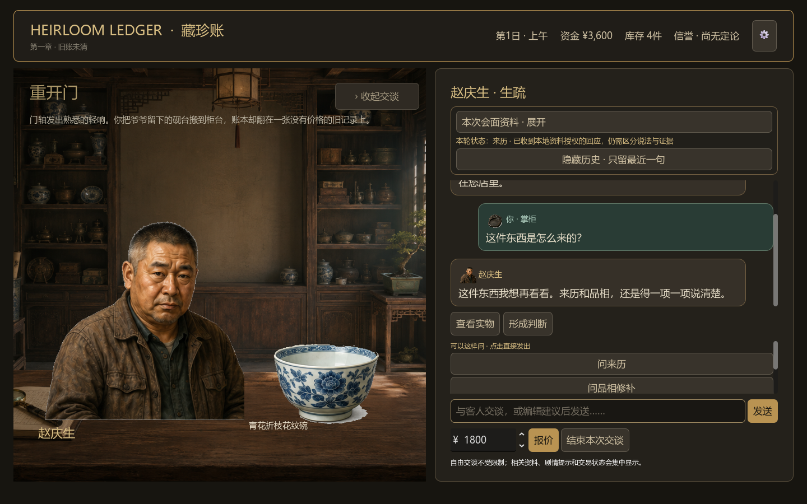
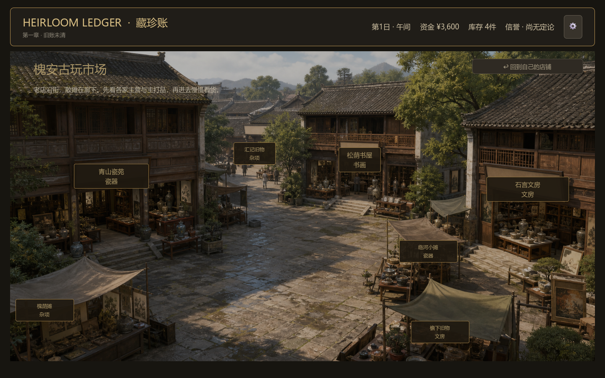
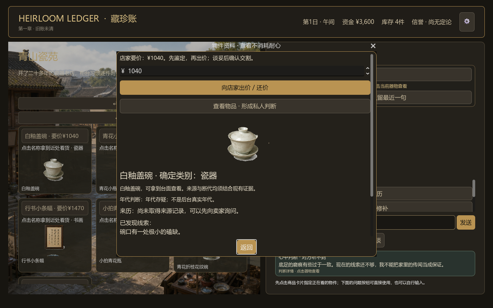
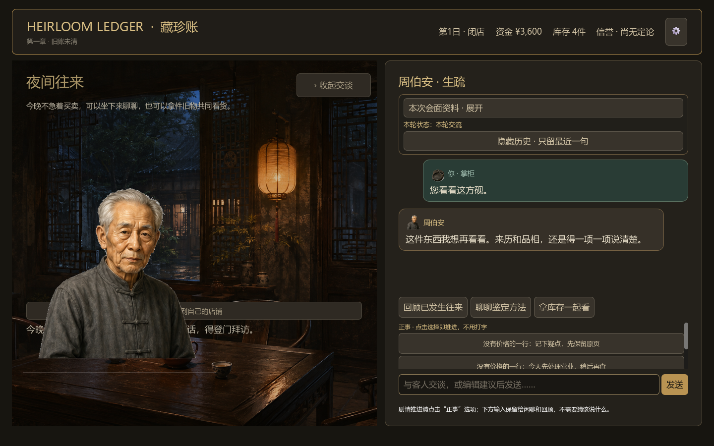

# Heirloom Ledger

## 旧物会说话，旧账终会有人翻开

一款关于古玩店、人与记忆的叙事经营游戏。

你在大城市失意后回到故乡，接手爷爷留下的小店。柜台上的每一件旧物都有来处，每一位客人都带着没有说完的话。你要学会观察、提问、鉴定、议价，也要在看不完整真相的时候，为自己的判断承担后果。

> **经营一家店，也是在整理一段没有结尾的人生。**



## 当前进度

**Playable Prototype · 第一章《旧账未清》**

项目已经从设计文档进入可试玩的 Godot 原型阶段：

- **经营模式已跑通**：从开始营业、接待来客、鉴定与交易，到午间外出、闭店结算和下一日推进，完整十日流程可以运行。
- **沉浸式柜台已成形**：货架、账本、调查笔记、门口、市场与夜间场景都可以探索；对话、私人判断、经营记录和剧情线索分层呈现。
- **交易判断成为核心玩法**：信息不完整，鉴定有风险，报价与成交由玩家决定；Game Core 负责结算资金、库存、知识、关系与后续影响。
- **剧情仍在打磨中**：当前重点是提升故事节点的吸引力、人物对白的自然度，以及真实模型在长对话中的记忆与一致性。

这是一章正在生长的原型，不是最终商业版本。当前设计仍处于 draft/review，试玩反馈会继续影响内容节奏、数值平衡和表达方式。

## 你将经历什么



每天开门后，客人会带着各自的目的走进店里。有人想卖掉一件来历含糊的器物，有人寻找一件符合记忆的旧物，也有人只是来确认你究竟是不是“懂行的人”。

你可以：

- 通过交谈判断客人的需求、动机与可信程度；
- 查看物件线索，决定是否复核、收购、推荐或放弃；
- 在整数报价与还价中保护现金流；
- 前往古玩街补货，拜访鉴定人，或在第三日起参加小型拍卖；
- 在账本与调查笔记中整理交易、人物关系和爷爷留下的疑问；
- 看着一次判断如何变成下一次机会，也如何留下迟来的代价。



故事不会把答案直接摆在你面前。照片、书信、旧账和人物记忆会逐渐拼出一段关系，但“旧物归人”与“有据可循”都需要玩家自己找到证据。

## 现在就进入试玩

当前试玩入口位于 [`prototype/`](prototype/) 目录，仅支持 Windows 本机运行。

1. 双击 [`prototype/开始试玩.cmd`](prototype/开始试玩.cmd)。
2. 在连接页填写服务商的 Base URL、Endpoint、协议、模型与 API Key。
3. 点击“连接并开始营业”，进入第一章。
4. 有存档时可以选择“继续已有章节”；想重新体验开场，请取消勾选并开始新章。

连接页支持保存多份接入配置，API Key 使用 Windows 当前用户保护保存，不写入仓库或普通游戏存档。实际模型请求可能产生服务商费用；默认自动检查使用本地模拟服务，不访问外部模型。

更完整的参数说明、存档位置、错误恢复方式与已知边界，请阅读 [`prototype/README.md`](prototype/README.md)。

## 一日经营循环

```text
开始营业
  → 上午来客：交谈、观察、鉴定、交易
  → 午间整理：查看账本，外出寻找货源
  → 下午来客：继续判断与经营
  → 闭店小记：整理今日结果与新线索
  → 进入下一日
```



第一章目前包含 10 日经营、8 位重要人物、28 件独立道具，以及围绕爷爷寄存记录展开的多类收束方向。数字与内容仍会根据试玩继续调整。

## 设计方向

Heirloom Ledger 想做的不是“点击正确答案”的古玩游戏，而是一个让判断产生重量的世界：

> **你说出的每句话，都会改变别人如何理解你。**<br>
> **你买下的每件东西，都会改变这家店接下来能走多远。**

游戏坚持将“事实”与“表达”分开：权威状态、真假、价格、库存和交易结果由 Game Core 决定；语言模型只负责在这些边界内表现人物的语气、犹豫、隐瞒与回应。

## 项目结构

- [`docs/`](docs/)：游戏设计的主要事实来源，从愿景、核心循环到世界、系统与剧情文档。
- [`prototype/`](prototype/)：Godot 第一章可玩原型与试玩入口。
- [`showcase/`](showcase/)：项目截图、作品集页面与演示视频。
- [`tests/`](tests/)：项目级检查与验证记录。

## 参与试玩

如果你愿意试玩，最有价值的反馈包括：

- 哪个瞬间让你开始对爷爷的旧账产生好奇？
- 你是否清楚自己为什么做出一次交易判断？
- 场景热点、调查笔记和人物关系是否容易找到？
- 对话是否像一个具体的人在回应，而不是在填充剧情？

欢迎把截图、复现步骤或一段对话记录带回来。现在的每一次试玩，都会成为这家小店下一版的设计依据。
