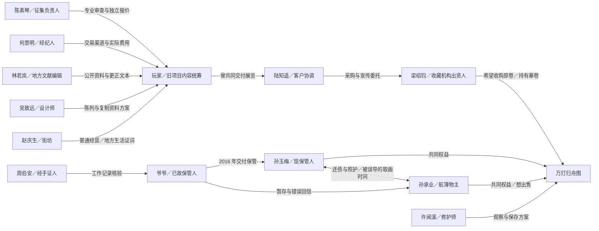

# 万灯归舟·人物与关系线路

> [!note] 版本
> 本页服务于 [[WANDENG_STORY]]。沿用八名原有 NPC 的基本职业与口吻，新增孙承业、陆知遥、梁绍钧三名核心人物。新增经历是当前方案内部的设定，不追溯改写旧原型人物。

## 1. 核心关系图

图中的连线不是都代表亲属或秘密共谋。历史交集只集中在孙家、爷爷和周伯安；其他人因职业、交易和公开项目进入。

## 2. 十一名 NPC 的独立诉求与完整人物弧

| 人物 | 独立于主角的生活目标 | 初期行动与保留 | 冲突中的主动决定 | 结尾可见变化 | 任务路线 |
|---|---|---|---|---|---|
| 孙玉梅 | 保住父亲的记忆，减少持续保管的负担，却害怕承认自己已经疲惫 | 主动阻止“整批卖掉”的说法，只允许有限看画 | 决定是否承认 2016 年后没有再主动联系哥哥；分开谈纪念与拥有 | 可以卖画后继续经营茶庄，也可继续保管；不会被写成只剩遗物的人 | M05→M07→M15→M16；S03；M21→M23 |
| 孙承业（新增） | 结束多年财务负担，重新开一个小作坊，不再靠家人承认才能生活 | 拒绝爷爷店经手航簿；保存爷爷旧回信 | 接受明确的交易条件而不原谅；真相出现后决定是否放弃惩罚姐姐 | 可收款离乡、留城重开作坊或保持距离；未和好也能体面离开 | M03→M04→M07；S04；M13→M16→M23 |
| 陆知遥（新增） | 在项目中有独立判断，不再一直替客户和同事擦掉难题 | 带来有合同的收购，承认自己也需要项目成功 | 决定是否交出自己有权分享的版本记录；拒绝为超预算方案作空头承诺 | 成为平等合作者，或结束私人信任但完成职业交接；不因高好感自动辞职 | M02→M12→M14；S09；M19→M24 |
| 梁绍钧（新增） | 使收藏机构持续运转，并维护家族在公众眼中的位置 | 相信馆藏真迹判断，主动为航簿出价 | 在审查结果出现后接受物件身份更正，却谈判历史呈现的范围；可撤回自己的项目资源 | 成为承认局部错误的买家、失去交易的竞争者，或仍保有摹卷但面对更正要求 | M09→M12；S10；M17→M20→M22 |
| 周伯安 | 保住自己做事可靠的名声，也不愿把亡友只剩的一面亲手打破 | 知道原卷当年在店里，不知道爷爷给孙承业回信的内容 | 在独立记录面前选择确认自己亲历部分；若拒绝口述，其已验证的书面记录仍可留档 | 与玩家建立基于本人责任的交往，或只保留正式往来 | M01→M07→M13→M15；S05；M23 |
| 许闻溪 | 维持专业质量和工作室生计，不把作品变成证明别人立场的工具 | 允许观察，不承诺一次看画得出绝对结论 | 拒绝为了展期隐去修护和摹本身份；提供不同成本的保全方案 | 可成为长期付费合作者，也可结束委托并移交已完成报告 | M06→M08→M10；S06；M18→M21 |
| 何景明 | 做成生意、保住渠道和应得报酬 | 提供代理收购，要求事前讲清谁拿佣金 | 在梁的高价和独立方案之间选择经纪安排；被绕开后停止无偿介绍但不伪造信息 | 成为承认玩家能力的同行，或保持只按合同合作的距离 | M03→M04；S07；M12→M17→M21 |
| 陈素琴 | 让机构的征集与说明经得起追问，且业务能继续做下去 | 核对授权、对接超出本人专长的专家 | 报价不够时如实说明，不拿不存在的买家劝原主接受 | 有条件建立长期委托，不因玩家坚持原则自动提供全额资金 | M08→M10→M17；S11；M20→M21 |
| 林若岚 | 做好地方文献编辑工作，让有依据但不夺目的内容获得位置 | 她仍是为长辈挑礼物的客人；在交易中透露自己正整理地方资料 | 将确定记录与口述分栏；决定是否在获准范围内署名更正，不替家属公开隐私 | 可保留合作与私人友谊，或因玩家擅用材料退出项目 | S02；M09→M11；S12；M19→M22 |
| 吴致远 | 做出真正能使用、负担得起的空间设计，获得正式项目 | 对古玩名头不迷信，会先量桌子与通道 | 提出原件不能展开时的替代陈列，不承诺一次展览保住整条旧街 | 有实际服务费与署名的合作，或只完成小项目继续自己的工作 | S08；M06→M11→M18→M22 |
| 赵庆生 | 修好旧宅、控制预算、保留体面 | 卖一件误以为名贵的家用旧物 | 接受诚实报价还是带走另问；愿否提供自有老照片的有限使用 | 房子修到哪一步、下次还来不来由交易体验决定，不强制变成护宝后人 | S01；M11 可选生活材料；M23 |

林若岚新增“地方文献编辑”身份是本版具体设定，仍保留既有挑礼物入口。她不独自鉴定原卷，也不能从工作关系中取得任何未经允许的私人文件。

## 3. 玩家与爷爷

玩家的固定过去限于本方案所需事实：曾任文化项目内容统筹，参与过来源尚未补齐的宣传交付。玩家不能事后选择“我从未参与”改写客观经历，但可决定现在怎样解释、承担与修正。该固定背景需随全篇方案审阅，不默认改变既有自定义范围。

玩家的成长不强制为从坏变好：早期也可以谨慎诚实，后期成长表现为能处理更大范围的责任和复杂合同，而非必须先犯一次错才能学会。

爷爷的作者真相分三层显露：愿意收下争议物的老掌柜 → 努力保管但没有解决家事的人 → 在一次明确沟通机会中作出错误陈述的人。后期仍应有普通好记忆，如替邻居保管修好却忘领的挂钟；这些记忆不用于抵扣错误。

## 4. 初始知情与解锁界限

| 人物 | 第一章实际知道 | 尚不知道／不能提前说 | 获知关键变化的事件 |
|---|---|---|---|
| 玩家 | 返乡、旧职业、陆与旧项目 | 原卷现址、爷爷回信、两卷真实关系 | M05、M10、M13，分别解锁 |
| 孙玉梅 | 自己 2016 年接画；共同权益未变 | 爷爷 2002 年回信具体内容；梁馆鉴定过程 | M13/M15 的有权分享材料 |
| 孙承业 | 航簿属于自己；爷爷说过交回姐姐；自己还债经过 | 画直到 2016 年才离店；现持物是否为原卷的专业结论 | M10/M13/M15 |
| 陆知遥 | 采购需求、旧项目版本问题、玩家家乡关系 | 原主家纠纷全貌、爷爷回信 | 玩家主动分享或正式方案材料 |
| 梁绍钧 | 自己的购藏记录、馆方既有认定、家族口述 | 孙家现持原卷的可信结论；全体护运人的完整记录 | M10 专业告知、M11 史料告知后改变谈判 |
| 周伯安 | 当年经手、2002 年画仍在店的工作记录 | 爷爷给孙承业的措辞、旧城市项目失误 | M13 对照材料 |
| 许闻溪 | 经授权接触的器物和记录 | 家属动机、藏家私下底价、完整财产分配 | 对应材料被明确分享后 |
| 何景明 | 市场渠道及自己参与的委托 | 隐藏物件和未经传播的专业报告 | 受托提供材料时 |
| 陈素琴 | 自己收到的授权和审查材料 | 谁应原谅谁、私下交易未传达条件 | 正式委托传达后 |
| 林若岚 | 可访问的公开文献和获准私人资料 | 爷爷私信、孙家支出隐私 | 经当事人授权后；拒绝则仍未知 |
| 吴致远／赵庆生 | 各自的设计和地方生活经验 | 所有后台真相 | 仅获准公开结果和本人参与事件 |

## 5. 关系变化必须落到行为

| 玩家行为 | 具体记忆 | 后续差异 |
|---|---|---|
| 航簿交易中把费用和用途先写清 | 孙承业记得“这次没有先替我答应” | 愿意直接谈共同查验；并非自动同意卖画 |
| 把公开压力当作逼孙玉梅出售的手段 | 她记得家事被用来压价 | 撤回非必要私人材料分享，出售仍须另谈 |
| 如实承认自己旧项目的职责 | 陆记得玩家没有把交付责任全推给她 | 愿在权限范围内共同出具更正说明 |
| 不结算何景明事先约定的服务报酬 | 经纪合作出现具体未结事项 | 独立买家路线需要陈素琴直接对接，何不再介绍 |
| 把许闻溪的“有依据判断”包装为绝对保证 | 她要求公开纠正引用 | 未纠正前拒绝为新说明签名；已完成专业记录仍存在 |
| 采用赵庆生未授权公开的家庭照片 | 他感到隐私被当成素材 | 撤回可撤部分使用许可，展陈换用合法替代材料；不能让已发生公开自动消失 |

关系阶段仍沿用既有规则，不新增统一道德值。回城、留城、卖画、不卖画本身不自动导致所有 NPC 同向加减关系。

## 6. 浪漫与幽默的角色分配

浪漫可来自陆与玩家在旧项目里记得彼此的工作习惯、孙玉梅还保留哥哥喜欢的茶、吴致远给没有原件的陈列留一束灯。关系亲密不等同于已确认恋爱，当前完整主线无需爱情线成立。

幽默保留人物差异：何景明忙于解释“可以再谈”究竟还有多少附加条件；吴致远总能用桌子不够长打断宏论；孙玉梅不容忍把每个旧茶杯都叫重器；梁在谈预算时精确到令人不便再讲情怀。核心损失和旧回信场景不插笑话。

关联：[[WANDENG_STORY]] · [[WANDENG_QUESTS]] · [[NARRATIVE_STYLE_GUIDE]]
