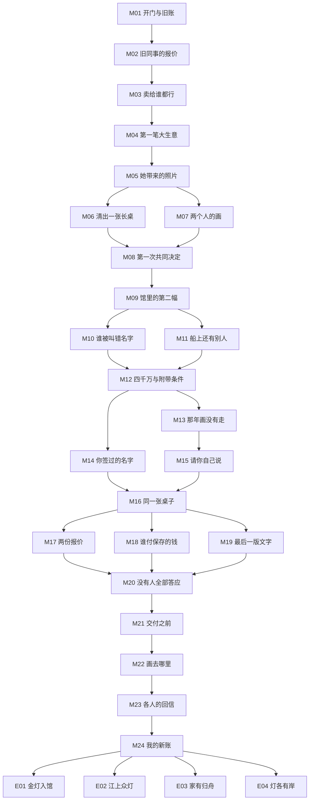

# 万灯归舟·主支线任务网络

> [!note] 规格层级
> 全篇含 24 个主线规划单元和 12 个支线规划单元。每个单元可拆成若干来访或记录节点，不等同于 36 天或 36 名来客。M/S 编号在本方案内稳定，未来若进入数据可统一加 `WD-` 前缀；目前不是可运行 schema。

故事真相见 [[WANDENG_STORY]]，人物动机见 [[WANDENG_CHARACTERS]]。以下包含剧情剧透。

## 1. 任务依赖与收束图

箭头表示前一单元进入“已处理”的某个结果，不一律要求成功。拒绝调查可产生 `未核实/拒绝/无权限` 的已处理记录，后续据此减少选项；它不会解锁不存在的证据。M21 确定物件处置，M24 汇合职业与人物尾声并呈现结局，最后选择不能反向更改成交。

## 2. 主线任务总表

### 第一章：有人替你买明天

| ID／标题 | 前置与人物 | 玩家行动 | 主要选择与成本 | 当下结果 | 后续影响 |
|---|---|---|---|---|---|
| M01 开门与旧账 | 开篇；周伯安 | 完成一笔基础经营，区分库存与寄存档案 | 保留疑问或先归档；查阅不耗时 | 老店营业成立，保管档案入口已知 | M02；S01/S02；不先揭露原卷现址 |
| M02 旧同事的报价 | M01；陆知遥 | 询问航簿需求、采购资金与服务报酬 | 接受有条件委托或拒绝；拒绝不失去经营 | 接受则有委托范围，拒绝则仅知采购消息 | M03；陆仍可因涉及旧项目向玩家提供后续公开信息 |
| M03 卖给谁都行 | M02；孙承业、何景明 | 听清“不让这家店经手”的理由，提出交易边界 | 自己协调、委托何代理并分佣、退出 | 直接谈判许可／代理安排／交易关闭 | M04；S04/S07；记录是否利用爷爷名声施压 |
| M04 第一笔大生意 | M03；孙承业、陆 | 核对航簿身份、所属及查阅/复制用途，处理报价 | 按授权出售、只同意研究、拒绝；售出后不自动回收 | 真正结算服务或购销；或明确未成交。记录“正、副卷”线索是否取得 | M05。没有读到航簿时只收到孙玉梅因采购风声来询问的入口，不凭空解锁内容 |

### 第二章：她守着的不是一幅画

| ID／标题 | 前置与人物 | 玩家行动 | 主要选择与成本 | 当下结果 | 后续影响 |
|---|---|---|---|---|---|
| M05 她带来的照片 | M04 任一结果；孙玉梅 | 解释参与范围，询问照片与画的保管情况 | 获准看有限资料、安排中立人接洽、拒绝 | 获准照片或“原主不提供资料”记录 | M06/M07；S03；不会强制开启家属私信 |
| M06 清出一张长桌 | M05；许闻溪、吴致远 | 安排不超权限的观察，对照照片与可见图像 | 授权条件成立才看原件；否则只看获准图像或暂停 | 观察线索与局限、是否有原件查验许可 | M08；S06/S08；无许可不能搬画到店 |
| M07 两个人的画 | M05；兄妹、周 | 核对父亲书面分配及后来交付记录 | 分别核对、中立代理核对、拒绝参与 | 两卷物件关系之外，另取得原卷共同权益结论；不足则标未核实 | M08；限制 M21 的出售与交接选项 |
| M08 第一次共同决定 | M06 AND M07；兄妹、陈 | 逐项谈查验、保存、费用与材料分享 | 达成联合查验／只允许书面研究／各方不同意 | 形成有效权限包或权限不足记录 | M09；专业结论可得范围受此限制；不会等同于售卖授权 |

### 第三章：第二幅真迹

| ID／标题 | 前置与人物 | 玩家行动 | 主要选择与成本 | 当下结果 | 后续影响 |
|---|---|---|---|---|---|
| M09 馆里的第二幅 | M08；林若岚、陆、梁 | 对照公开展览、购藏说明、孙家获准资料 | 请求馆方合作查验、先用公开资料、退出 | 两幅物件的不同图像与来源说法被列出 | M10/M11；S10/S12 |
| M10 谁被叫错名字 | M09；许、陈 | 提交授权材料，阅读独立审查意见，询问局限 | 承担约定费用完成比对／降低研究范围／延期 | 足够材料下形成“孙家原卷／馆藏摹卷”的支持性意见；不足则保留未知 | M12 的报价是有效条件意向或仅假设方案；禁止未知直接出售为原作 |
| M11 船上还有别人 | M09；林、吴 | 比对航簿或独立装运记录，核实多方护运贡献 | 获准署名整理／只保留研究／不追查 | 取得可用的历史结论，或仅确认公开叙事待核实 | M12/M19；S01/S12 增加生活层次，不是必需钥匙 |
| M12 四千万与附带条件 | M10 AND M11；梁、陆、何 | 分开询问价格、身份更正、展览范围和项目合作 | 继续谈、寻找替代、拒绝；不在此绑定出售 | 梁的有条件报价或没有有效报价；旧项目署名进入视野 | M13/M14；此处报价不加库存资金，不代表成交 |

### 第四章：你也签过名字

| ID／标题 | 前置与人物 | 玩家行动 | 主要选择与成本 | 当下结果 | 后续影响 |
|---|---|---|---|---|---|
| M13 那年画没有走 | M12；孙承业、周 | 比对爷爷 2002 年回信与同年保管记录 | 请求正式核验／只记下矛盾／拒绝 | 两记录可信时确定错误陈述；不充分则不得断言爷爷撒谎 | M15；S05；家属会记得玩家是否抢先传播指控 |
| M14 你签过的名字 | M12；陆 | 查阅双方有权访问的旧稿与批准记录 | 承担本职部分并更正／推责／不参与 | 记录旧项目职责与玩家现在的处理；无权文件不复制 | M16/M19；S09；不因“认错”凭空恢复职位 |
| M15 请你自己说 | M13；周、兄妹 | 请各方确认本人亲历，限定可分享范围 | 正式说明／仅家属沟通／保持未核实 | 2002 与 2016 交付时间得到交叉核验，或保留争议 | M16；周不愿出镜也不能抹掉已认证工作记录 |
| M16 同一张桌子 | M14 AND M15；兄妹 | 将钱、照护、纪念、画权分开谈 | 直接会谈／各自书面回复／停止调停 | 分别获得出售、保留或拒绝立场，不强制和好 | M17/M18/M19；对真相的承认与售卖许可分别记录 |

### 第五章：谁来出这笔钱

| ID／标题 | 前置与人物 | 玩家行动 | 主要选择与成本 | 当下结果 | 后续影响 |
|---|---|---|---|---|---|
| M17 两份报价 | M16；陈、何、梁 | 索取实名渠道的有效条件意向，比对净收益与义务 | 保留梁方案／付出约定服务成本寻找独立报价／不卖 | 有效买家集合；没有资金或渠道支持不能虚构同价替代 | M20；S07/S11 改善渠道与费用，不是唯一入口 |
| M18 谁付保存的钱 | M16；许、吴、兄妹 | 对照保全、修护、原件展出与资料陈列方案 | 原主付费／有效赞助或买家承担／只做基础保存／不新增委托 | 实际费用承担者与保管方案 | M20；S06/S08 改变可行成本；没有预算时仍有现状记录路线 |
| M19 最后一版文字 | M16；陆、林、梁 | 分开更正作品身份、运输功绩、家庭私人经过 | 确证后公开／准确但有限说明／保留待核；若坚持错误陈述记录风险 | 可公开文字及相应材料权限，不把私人真相自动上墙 | M20；S09/S10/S12 改变合作，不替代准确性 |
| M20 没有人全部答应 | M17 AND M18 AND M19；相关各方 | 看清方案差异和拒绝理由，提交一个具体方案 | 修改方案／请求暂停／正式通知不参与梁采购并转向另一方 | 暂停维持已明确权限；主动退出则梁报价和岗位机会关闭，保留记录 | M21；关闭前明确提示后果，无隐藏计时 |

### 第六章：归舟不必同岸

| ID／标题 | 前置与人物 | 玩家行动 | 主要选择与成本 | 当下结果 | 后续影响 |
|---|---|---|---|---|---|
| M21 交付之前 | M20；兄妹、实际买家、陈/代理 | 核对最终授权、对价、物件、保存和说明版本 | 执行 E01/E02/E03 对应方案；不足则 E04 | 仅有效方案完成资金与实物交付；无有效方案记录现状和经手边界 | M22；此后不能靠尾声选项撤销正常成交 |
| M22 画去哪里 | M21；林、吴、陆、梁 | 查收交付结果和获准公开的报告/展陈消息 | 核实发布是否符合约定；发现差异则提出更正或保留异议 | 看见原卷去向、摹卷名称与公开文字的实际结果 | M23；公开后的反应只来自已看到材料的人 |
| M23 各人的回信 | M22；各核心人物分次回访 | 听见钱、关系和职业合作的具体变化 | 回应、兑现尚未完成的承诺或拒绝新邀请 | 孙家、周、合作伙伴各自落点；未解责任不凭结束消失 | M24；不塞进同一天十一人齐聚 |
| M24 我的新账 | M23；玩家、陆及一名普通来客 | 根据已存在的岗位/合作与经营选择个人去向 | 留店／接受可兑现岗位／已有合作下往返；未具条件不显示 | 合并物件结局、职业、关系与公开记录，完成全篇 | 终章闭合；后续是否自由经营另属产品范围 |

## 3. 支线网络：12 条有去有回的任务

支线默认可不做。它们改变具体资源、关系与呈现，不垄断完成主线必须的真相。

| ID／标题 | 开放前置／主角 | 玩家实际行动与选择 | 结果与代价 | 接入及回响 |
|---|---|---|---|---|
| S01 祖传到上个月 | M01；赵庆生 | 对其旧物说明观察与价格；诚实收购、推荐其他用途或拒收；另询老照片用途授权 | 可做成小额生意，也可让他带走；照片与交易分别授权 | M11 可补生活图像；M23 回访修房进度；没有照片不阻止史料研究 |
| S02 礼物不用替人说话 | M01；林若岚 | 询长辈偏好，在名头与来源可交代之间推荐 | 合适且如实说明可正常获利；不把任务变成“贵就错” | 她通过交往介绍文献工作；M09 仍有公开资料入口 |
| S03 父亲常坐的位置 | M05；孙玉梅 | 帮她从普通遗物里区分纪念与可出售部分 | 自主选择保留照片或日用器；其余经授权可成交 | M16 多一种“卖画后仍保留记忆”的提案；不直接加售画同意 |
| S04 卖掉以后做什么 | M03；孙承业 | 听其重开作坊的具体预算，比较出售航簿与其他自有物的收益 | 提供诚实经营建议与实际小交易；不替他保证创业成功 | M16/M17 的分配诉求具体化；M23 出现作坊、清偿或改计划的差异 |
| S05 老朋友的慢钟 | M07；周伯安 | 核对一件普通寄修钟的领取记录，决定是否接新保管委托 | 写清新责任或拒绝；没有神秘夹层 | M13 他更愿谈亡友，但核心证据仍走正式档案核验；M23 新保管习惯不同 |
| S06 不必修成从未发生 | M06；许闻溪 | 在一件普通器物上比较保全与过度补新方案，按授权委托 | 承担明确服务费，理解修护记录为何必须保留 | M18 可采用已讨论的分阶段成本；不永久提高鉴定到无误 |
| S07 这一单算谁的 | M03；何景明 | 在一笔与原卷无关的转介交易前谈清介绍费与责任 | 正常合作双方获利；绕开既定约定造成具体争议 | M17 是否得到额外渠道和经纪优惠；陈的基础询价仍可进行 |
| S08 装得下的一座城 | M06；吴致远 | 为小空间选购实际装饰物并确定获准复制资料的展示范围 | 可以卖出不出名但合适的库存；吴获得合理设计报酬 | M18/M22 能选择轻量陈列；不凭一张画解决全城建筑保存 |
| S09 那封没有发出的邮件 | M14；陆知遥 | 讨论她当年准备提出却未发出的修改意见，与已发版本核对 | 玩家可承认共同压力也坚持各自职责；拒绝情绪勒索 | M19 是否共同署名更正；M24 合作亲疏变化；未寄邮件不单独证明当年所有责任 |
| S10 不在名录上的那一天 | M12；梁绍钧 | 看他个人保存、愿意分享的一张旧展览票与小额购藏记录，谈起父亲带他看画的经历 | 决定把他当有真实热爱的人谈判，或只保持业务距离；不交换核心证据 | M19 更正表达可更克制；不会因理解动机自动撤销商业条件 |
| S11 已经卖出去的东西 | M10；陈素琴与既有买家 | 回看一次真实已成交物件的说明，处理买家转展/转卖前的核实请求 | 若确有错误且被发现，按已知问题解释；若无错误则完成准确补充 | M17 的合作评价与M23回访；不必强制玩家先卖假货，不自动退款 |
| S12 名字写在什么地方 | M11；林若岚 | 对获准史料确定署名、出处与私人内容删节 | 选择准确署名、匿名或不使用；未经授权的个人内容不能强行公开 | M19/M22 展示哪些人及材料；任务不替任何人自动表达原谅 |

## 4. 证据网络与替代路径

| 证据编号 | 内容与主要入口 | 能支持什么 | 不能支持什么 | 入口关闭时的路线 |
|---|---|---|---|---|
| V01 | 孙家父亲的分配文件及后续核验，M07 | 原卷共同权益、航簿个人权益的方案内事实 | 艺术真伪、感情债务 | 当事人不同意给玩家时可由中立受托方核验范围；仍无有效核验则限制交易，走 E04 |
| V02 | 航簿正副卷记录，M04 | 当时装运过两个对应卷件 | 现存哪一幅必为原作 | 获准副本或向当时买家申请研究；都无许可则用 V03 的独立材料，不能复制同一页冒充新来源 |
| V03 | 公开旧著录、孙家 1946 年收回记录及顾砚舟工作记录，M09/M10 | 两卷流转与摹卷制作的多来源关系 | 单独确认眼前材质与笔墨 | 缺一类时审查结论降级；不足不能把怀疑写成真迹保证 |
| V04 | 原件、摹卷的获准专业观察与独立审查，M06/M10 | 与 V03 合用支持身份意见与保存情况 | 所有权、祖先功绩 | 未获原件或馆方查验权限时可形成有限意见，E01/E02 的真实成交须后续补齐，或走保留/未成交 |
| V05 | 航簿费用条目或独立承运收据/当时公开报告，M11 | 多人护运与承担费用 | 每个人的心理、画权自然转移 | 至少一组独立材料有核验后可否定“独力”；人数细节不足则不编造完整英雄名单 |
| V06 | 孙承业的 2002 年春回信、同年冬连续保管记录、2016 年首次实际交付记录，M13/M15 | 三者交叉支持爷爷错误交付说法与实际时间矛盾；不是只因两纸同年就判定 | 爷爷内心全部动机、交易当年必能挽救作坊 | 可走本人确认或正式档案核验；缺失则保留不确定，仍可单独谈未来物权安排 |
| V07 | 旧项目合法可访问版本与署名记录，M14 | 玩家与陆各自负责和知情的范围 | 梁一开始就知道摹卷身份 | 已公开版本加本人说明可启动有限更正；不能为通关盗取公司未授权文件 |
| V08 | 最终方案、双方授权、费用承诺与交接记录，M17—M21 | 哪个结果可被执行 | 家庭关系自动改善、未来无限开放 | 缺少任何必要项则退回方案调整或 E04，不由“高好感”跳过 |

主线没有要求收齐所有 V 编号。出售需要 V01、足够的 V03/V04 和 V08；准确谈家庭旧事需要 V06；公开多人护运说明需要 V05。不同问题使用不同证据集合。

## 5. 四个关键分支的节点规格

### G01：M04 航簿成交后，谁还能看它

- **目标：** 玩家促成一笔有诱因的交易，同时理解实物转让与获准资料使用不同。
- **入口：** M03 已记录直接谈判、代理或退出结果。
- **玩家已知：** 物主是谁、买家用途、当前报价、代理费用；未读到页面时不知道“正副卷”。
- **A：** 原主和买家共同接受有限研究副本安排后成交。结算约定价款/服务收入，副本只能按获准范围使用。
- **B：** 买家只接受原件与其约定用途，原主同意而不保留研究副本。可以成交，但玩家若未看过内容就仍不知道；后续向买家申请或走独立文献。
- **C：** 不成交，只获得原主明确许可的现场查阅；玩家得研究入口，不能获得售卖收入。
- **D：** 完全退出。航簿保持原主所有；孙玉梅仍因采购请求得知事情，有理由主动来问。
- **公平性：** 在选择前说明能否保留资料与费用，不把阅读档案消耗成错过买家的惩罚。
- **Core 结算范围：** 物件持有人/权利状态、合同与费用、获准副本、玩家已读线索、人物具体记忆。各项分开保存。
- **LLM 限制：** 不得用成交对白生成副本、替原主许可、透露未读页面。
- **AC：** 四条路线都能进入 M05；只有实际成交有成交款；B/D 不会偷得 V02；普通成交不自动撤销。

### G02：M15 把爷爷的错误交给谁

- **目标：** 核验保管经过并决定分享范围，而非选择是否喜欢爷爷。
- **入口：** M13 有具体证据矛盾或“未核实”记录；证据不足时只能请求补证或说明未知。
- **A：** 向兄妹分别提交已经核验的事实。可形成共同认可的时间线，孙玉梅仍可拒绝出售。
- **B：** 请求周本人说明。他若不愿，可使用已核实书面记录，不强迫“关系刷满就坦白”。
- **C：** 不继续追究过去，只提议明确今后的共同权利与保存。减少和解机会，但不锁死 E01/E03 的未来协议。
- **D：** 将获准公开的部分对外说明；未获公开许可的家事不纳入正式发布方案。若玩家在对话中擅自传播，则记实际接收人与内容，依现有传播逻辑处理。
- **公平性：** 接受事实、授权出售、私人原谅是三个记录，不能合并成一个“孙家线完成”。
- **Core 结算范围：** 证据核验、分享对象、公开许可、双方对处置的明确意见、具体记忆；不自动变更画权。
- **LLM 限制：** 不能替死者临时补一封自白书，不能替兄妹宣布原谅。
- **AC：** 证据不足不出现确证措辞；不同分享范围产生不同人物反应；任何选项不直接完成卖画。

### G03：M20 关闭梁的方案

- **目标：** 让机会成本可见且来自玩家和人物行动，不来自隐藏倒计时。
- **入口：** M17—M19 均有已处理状态，各方案列出有效条件和缺口。
- **A：** 保留梁方案并继续谈准确说明与开放范围。不承诺成功，也不重复支付同一项已付服务费。
- **B：** 提交已满足基本条件的独立方案，并正式通知不参与梁采购。选择前明确：本次梁报价与相关岗位机会关闭，普通行业关系不一定永久断绝。
- **C：** 提议原主保留，明确费用。若没人承担额外保存安排，则仅能确认当前持有和现有保管，不能生成免费机构库房。
- **D：** 暂缓或结束本次经手。暂缓保留已写明权限与未决清单；结束进入无成交的交接路线。
- **恢复：** 在正式撤回/退出前可调整；退出后不能点“稍后”还原同一报价。以后新报价必须由新事件成立，不作为本篇无代价补偿。
- **Core 结算范围：** 方案有效性、报价活动状态、职业机会状态与告知记录；无画款在此结算。
- **LLM 限制：** 不得凭戏剧性突然让梁翻倍报价、撤销已同意的实物权利或封杀全行业。
- **AC：** 退出有预告与记录；暂停不关闭；已关闭方案在 M21 不可选；无支线完成也有 E04。

### G04：M21—M24 结局结算

- **入口：** M20 已有具体选择，M21 重新核对报价仍有效、权利方同意、专业说明与交付费用。
- **执行：** 将物件结果先定为 sale_liang / sale_independent / retained / unresolved 之一；这只是草案状态命名，不是权威 schema。
- **职业：** 梁项目岗位只在书面机会仍有效时可选；独立往返合作需有实际完成的委托和双方邀请；留店可选但不保证盈利。
- **人物：** 孙家以是否核验和承认事实、是否达成处置为依据；陆以 M14/S09 的责任处理为依据；同行以实际合作记忆为依据。
- **公开：** 私下专业更正、机构公开更正、多方护运展示分别记录，不合并成“真相大白”。
- **失败：** 无有效交易时，记录现持有人、未解决的另一方诉求、玩家已完成交接和未完成责任；不能清空争议或销毁物件。
- **Core 结算范围：** 一次性钱货/服务费结算、物件去向、交接权限、已公开内容、邀请与人物回访条件。
- **LLM 限制：** 不能在结尾自动买回画、让 NPC 复合、创造新职位或把未知历史写成确定旁白。
- **AC：** M24 不能重写 M21；重复查看结尾不重复结款；可见尾声只依据已完成事件；四种主结局均有闭合终场。

## 6. 拒绝与失败的通用约定

当前草案区分 `达成 / 未达成但已回应 / 暂缓 / 明确关闭`。前两者可以推进后续讨论，但只有达成的权限或证据能解锁相应行动。暂缓保留回访入口，明确关闭必须有玩家可理解的原因与提示。

家属不肯谈：通过独立受托核验争议边界，或走未成交结局。买家退出：只有已存在且条件有效的独立方案能接续。资金不足：普通经营与既有经营恢复规则继续；没有钱不自动获得修護服务。专业证据不足：保留未知，不随机强制判断后处罚。普通售出物件的后续问题只按既有发现与传播规则处理。

## 7. 营业循环与规模控制

- 每个交谈节点通过来访、电话、信件、获准物件和记录呈现。实际来客占用现有名额，文档查阅不耗时。
- 一章不强制等于固定天数；剧情按条件组合推进。约定和报价是叙事条件，不新增行动点、精确时钟或预约系统。
- 每个核心揭示后安排普通经营的缓冲内容，优先使用 S01/S02/S07/S08 中的轻型交易，而不是再发一封悲伤遗书。
- 没有支线也能经历全篇并获得至少一个有根据的结果；支线主要扩展资源与人物细节，不按全收集奖励所谓真结局。
- 长卷原件观察、正式审查和交易交付不可由随机日常故事重复生成。LLM 不能把它作为常规库存或临时再出现的另一幅原作。

关联：[[WANDENG_STORY]] · [[WANDENG_CHARACTERS]] · [[WANDENG_PRODUCTION_PLAN]] · [[QUEST_TEMPLATE]]
